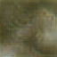

# TASK MACHINE LEARNING

This is a ML Homework.

## TASK 1: CHOOSING A MODEL

    Find a Text to Image model with code and train it for only 1 epoch.

1. **MODEL** 

    DAE-GAN: Dynamic Aspect-aware GAN for Text-to-Image Synthesis

    * [DAE-GAN Paper](https://openaccess.thecvf.com/content/ICCV2021/papers/Ruan_DAE-GAN_Dynamic_Aspect-Aware_GAN_for_Text-to-Image_Synthesis_ICCV_2021_paper.pdf)
    * [ORGINAL REPO](https://github.com/hiarsal/DAE-GAN)


        

    *source: Image from [DAE-GAN Paper](https://openaccess.thecvf.com/content/ICCV2021/papers/Ruan_DAE-GAN_Dynamic_Aspect-Aware_GAN_for_Text-to-Image_Synthesis_ICCV_2021_paper.pdf)*

2. **INSTALL** (Anaconda for Python Environment)

    *Make sure to install Anaconda*

    a. create a conda environment 
    ```bash
    conda create -n dae python=3.9
    ```
    b. activate the `dae` environment
    ```bash
    conda create -n dae python=3.9
    ```
    c. Install dependecies
    ```bash
    pip install -r requeriments.txt
    ```

3. **TRAINING**

    **Note:**
    I am going to share a drive link with the pre-trained models and pickles files but I am not the owner of these files. I just find very helpful to have all of them in just one link, since it was a bit tedious to find them all in the original repo. 

    * [pretrained_models](https://drive.google.com/drive/folders/16FaCL_XToR0fX8KJRjkhPVYfLusLe0Mj?usp=drive_link)

    * [caption_data](https://drive.google.com/drive/folders/1V3uUyplzS1B-TSUeI_T56puykf0rl_L6?usp=sharing)

    Then, steps for training:

    a. download dataset in folder `data/birds`

    b. download captions.pickle, pre-trained models (image_encoder200.pth & text_encoder200.pth) and captions texts to `pretrained_models`.

    d. Modify the `birds_DAEGAN_train.yaml` to your parameters. Since I am only trainnig for 1 epoch with a single gpu, I set BATCH_SIZE to 2 and MAX_EPOCH to 1.

    e. run 
    ```bash
    python train.py --cfg bird_DAEGAN_train.yml --gpu 0
    ```

    f. output trained models are saved in `output` folder

    


4. **SAMPLE INPUT - OUTPUT**

    * INPUT: 
    ```python
    prompt = 'a small red and white bird with a small curved beak'
    ```
    * OUTPUT:

    


5. **TRAINING DATASET**

    * [Caltech-UCSD Birds-200-2011 (CUB-200-2011)](http://www.vision.caltech.edu/datasets/cub_200_2011/)


6. **NUMBER OF PARAMETERS**

    * Discriminator: 1878242
    * Generator: 19261264

7. **MODEL EVALUATION METRIC**

8. **TRAINED MODEL**

    * [disc.pth](https://drive.google.com/drive/folders/1tuLivH_jDZtM-kt0Cgjb3UD7OIewVvZy?usp=sharing)
    * [gen.pth](https://drive.google.com/drive/folders/1tuLivH_jDZtM-kt0Cgjb3UD7OIewVvZy?usp=sharing)

9. **MODIFICATIONS**

    Regarding modifications from the original repo and this specific ML homework are basically updates in Pytorch functions and gpu role in dataset dataloader since the original repo has a train file for multiple trainning distribution. Also, a inference file has been created in order to get a modular code for local deployment.


## TASK 2: LOCAL DEPLOY MODEL

Local deploy based on streamlit framework

1. **INSTALL** (Anaconda for Python Environment)

    *Make sure to install Anaconda*

    a. create a conda environment 
    ```bash
    conda create -n dae python=3.9
    ```
    b. activate the `dae` environment
    ```bash
    conda create -n dae python=3.9
    ```
    c. Install dependecies
    ```bash
    pip install -r requeriments.txt
    ```

2. **SET UP TRAINED MODELS**

    * Download trained & pretrained models for inference in `APP/src/daegan/pretrained_models` folder   
    * Expected distribution:
    
        

2. **RUN LOCALLY**

    * Go inside folder `APP`
    ```bash
    streamlit run app.py 
    ```

3. **SAMPLES**

    * INTRO

    

    * INPUT PROMPT

    

    * OUTPUT

    


## TASK 3: Demonstration

Since this is an ML homework, the Task 3 has been shared by an email to the ML Homework reviewer.